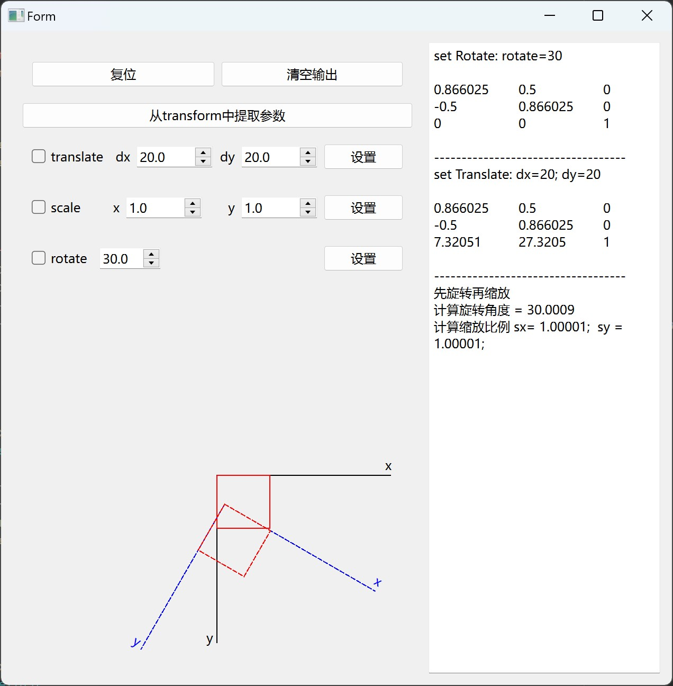

# reversetransform
reversetransform is an simple program to show the QTransform by graphis and text. QTransform's effect to The graphic will be show by a realtime change of an rectangle, and the struct of matrix will be show in a textarea.this projec can help us explain the tranform's process and the method of how to compute to get QTransform's matrix.And offer one method to compute the original param whitch set for totate(),scale(),translate().
# Screenshots

